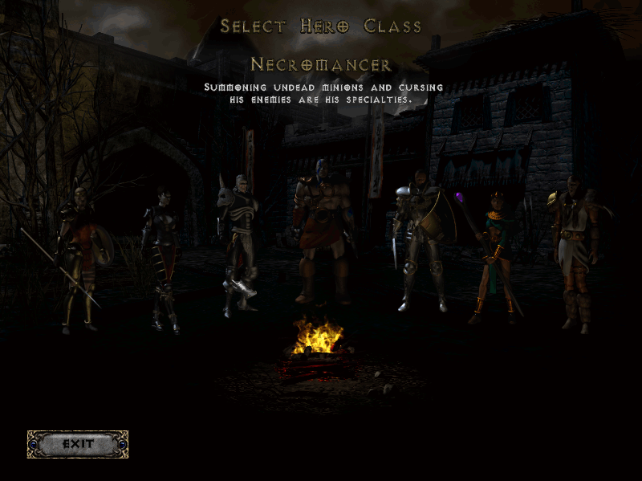

# OpenDiablo2
[](https://circleci.com/gh/OpenDiablo2/OpenDiablo2/tree/master)


[Join us on Discord!](https://discord.gg/pRy8tdc)\
[Development Live stream](https://www.twitch.tv/essial/)\
[Support us on Patreon](https://www.patreon.com/bePatron?u=37261055)

We are also working on a toolset:\
[https://github.com/OpenDiablo2/HellSpawner](https://github.com/OpenDiablo2/HellSpawner)\
Please consider helping out with this project as well!

## About this project

OpenDiablo2 is an ARPG game engine in the same vein of the 2000's games, and supports playing Diablo 2. The engine is written in golang and is cross platform. However, please note that this project does not ship with the assets or content required to play Diablo 2. You must have a legally purchased copy of [Diablo 2](https://us.shop.battle.net/en-us/product/diablo-ii) and its expansion [Lord of Destruction](https://us.shop.battle.net/en-us/product/diablo-ii-lord-of-destruction) installed on your computer in order to run that game on this engine. If you have an original copy of the disks, those files should work fine as well.

We are currently working on features necessary to play Diablo 2 in its entirety. After this is completed, we will work on expanding the project to include tools and plugin support for modding, as well as writing completely new games with the engine.

Please note that **this game is neither developed by, nor endorsed by Blizzard or its parent company Activision**.

Diablo 2 and its content is ©2000 Blizzard Entertainment, Inc. All rights reserved. Diablo and Blizzard Entertainment are trademarks or registered trademarks of Blizzard Entertainment, Inc. in the U.S. and/or other countries.

ALL OTHER TRADEMARKS ARE THE PROPERTY OF THEIR RESPECTIVE OWNERS.

## Status

At the moment (october 2020) the game starts, you can select any character and run around Act1 town.

Much work has been made in the background, but a lot of work still has to be done for the game to be playable.

Feel free to contribute!

## Building

To pull the project down, run `go get github.com/OpenDiablo2/OpenDiablo2`

On windows this folder will most likely be in `C:\users\(you)\go\src\github.com\OpenDiablo2\OpenDiablo2`

In the root folder, run `go get -d` to pull down all dependencies.

To run the project, run `go run .` from the root folder.

You can also open the root folder in VSCode. Make sure you have the `ms-vscode.go` plugin installed.

### Linux

There are several dependencies which need to be installed additionally.
To install them you can use `./build.sh` in the project root folder - this script takes care of the installation for you.

## Contributing

The imports for this project utilize `github.com/OpenDiablo2/OpenDiablo2`. This means that even if you clone the repo, changes will not be taken as it will
still pull from the main repo's files. In order to use your local version, add the following to `go.mod` in the base folder:

```
replace github.com/OpenDiablo2/OpenDiablo2 => /your/forked/import/path
```

This will tell go to use your local path instead of the official repo. Be sure to exclude this change from your pull requests!

If you find something you'd like to fix that's obviously broken, create a branch, commit your code, and submit a pull request. If it's a new or missing feature you'd like to see, add an issue, and be descriptive!

If you'd like to help out and are not quite sure how, you can look through any open issues and tasks, or ask
for tasks on our discord server.

**As of Oct. 26, 2020 we will no longer be accepting pull requests that introduce lint errors.**

We use `golangci-lint` to catch lint errors, and we require all contributors to install and use
 it. Installation instructions can be found [here](https://golangci-lint.run/usage/install/).

## VS Code Extensions

The following extensions are recommended for working with this project:

-   ms-vscode.go
-   defaltd.go-coverage-viewer

When you open the workspace for the first time, Visual Studio Code will automatically suggest these extensions for installation.

Alternatively you can get to it by going to settings <kbd>Ctrl+,</kbd>, expanding `Extensions` and selecting `Go configuration`,
then clicking on `Edit in settings.json`. Just paste that section where appropriate.

## Configuration

The engine is configured via the `config.json` file. By default, the configuration assumes that you have installed Diablo 2 and the
expansion via the official Blizzard Diablo2 installers using the default file paths. If you are not on Windows, or have installed
the game in a different location, the base path may have to be adjusted.

## Profiling

There are many profiler options to debug performance issues. These can be enabled by suppling the following command-line option and are saved in the `pprof` directory:

`go run . --profile=cpu`

Available profilers:\
`cpu` `mem` `block` `goroutine` `trace` `thread` `mutex`

You can export the profiler output with the following command:\
`go tool pprof --pdf ./OpenDiablo2 pprof/profiler.pprof > file.pdf`

Ingame you can create a heap dump by pressing `~` and typing `dumpheap`. A heap.pprof is written to the `pprof` directory.

You may need to install [Graphviz](http://www.graphviz.org/download/) in order to convert the profiler output.

## Debugging

### Layouts

Layouts can show their boundaries and other visual debugging information when they render. Set `layoutDebug` to `true` in `d2core/d2gui/layout.go` to enable this behavior.


## Roadmap

There is an in-progress [project roadmap](https://docs.google.com/document/d/156sWiuk-XBfomVxZ3MD-ijxnwM1X66KTHo2AcWIy8bE/edit?usp=sharing),
which will be updated over time with new requirements.

## Screenshots





## Additional Credits

-   Diablo2 Logo
    -   Jose Pardilla (th3-prophetman)
-   DT1 File Specifications
    -   Paul SIRAMY (http://paul.siramy.free.fr/_divers/dt1_doc/)
-   Other Specifications and general info
    -   Various users on [Phrozen Keep](https://d2mods.info/home.php)
