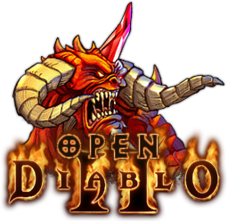

# OpenDiablo2

----
[OpenDiablo2](https://opendiablo2.com/) is an ARPG game engine in the same vein of the 2000's games, and supports playing Diablo 2.

The engine is written in Go and is cross platform.

> The project does not ship with the assets or content required to play Diablo 2.
You must have a legally purchased copy of [Diablo 2](https://us.shop.battle.net/en-us/product/diablo-ii) and its expansion [Lord of Destruction](https://us.shop.battle.net/en-us/product/diablo-ii-lord-of-destruction) installed on your computer in order to run that game on this engine.

If you like to contribute to OpenDiablo2, please be so kind to read our [Contribution Policy](./docs/CONTRIBUTING.md) first.

----

## Documentation

_Stay awhile and listen_ ...

### ⚡ Project Info

* 👉 **[Current Status](./docs/status.md)** 👈 - what you should focus on
* [Roadmap](./docs/roadmap.md) - Planning ahead
* Design - High-level overview of the OpenDiablo2 org and its projects
* [FAQ](./docs/faq.md) - Common questions from new people to the project

### ⭐ For Users

* [Purchase](./docs/purchase.md) - Buy the official game from Blizzard
* [MPQ](./docs/mpq.md) - Locate the MPQ files
* [Install](./docs/install.md) - Install OpenDiablo2 to your system (Linux/Windows/MacOS)
* [Run it](./docs/play.md) - How to play the game

### 🔥 For Developers

* [Building](./docs/building.md) - Instructions for building the project
* [Development](./docs/development.md) - Instructions for developers who want to contribute
* [Profiling](./docs/profiling.md) - Debug performance issues
* [Debugging](./docs/debug.md) - Common errors and pitfalls

## Screenshots

## Additional Credits

*   Diablo2 Logo
    *   Jose Pardilla (th3-prophetman)
*   DT1 File Specifications
    *   Paul SIRAMY (http://paul.siramy.free.fr/\_divers/dt1\_doc/)
*   Other Specifications and general info
    *   Various users on [Phrozen Keep](https://d2mods.info/home.php)

## Legal Notice

Please note that **this game is neither developed by, nor endorsed by Blizzard or its parent company Activision**.

Diablo 2 and its content is ©2000 Blizzard Entertainment, Inc. All rights reserved. Diablo and Blizzard Entertainment are trademarks or registered trademarks of Blizzard Entertainment, Inc. in the U.S. and/or other countries.

ALL OTHER TRADEMARKS ARE THE PROPERTY OF THEIR RESPECTIVE OWNERS.
