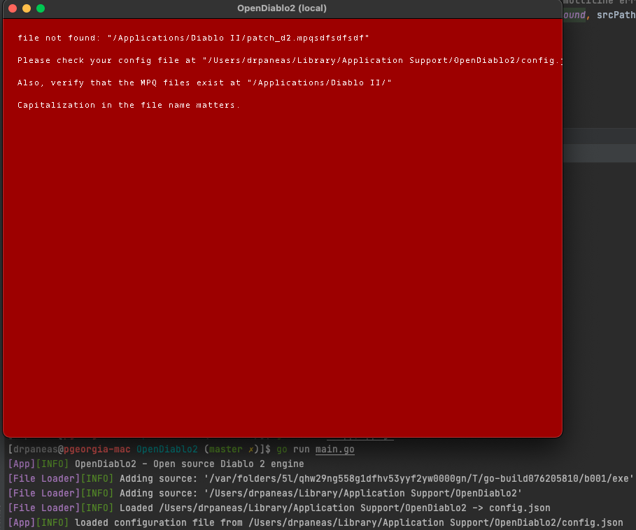

# Install OpenDiablo2

We currently provide binaries only for [Patreon supporters](https://www.patreon.com/bePatron?u=37261055) to [download and auto-update](https://www.patreon.com/posts/thanks-for-38407582).
If you are not one of those, you need to follow the developer documentation for building the project using Go.

Once you have an executable/binary of OpenDiablo2 (either provided via Patreon or building your own), then just launch it.

### Error? It's expected!

In case there is an error, it's most likely related to MPQ files.
You need to modify `config.json`.

Run the binary once; it should let your know where the location of this file is.
For example:



In this specific case (MacOS) the file is located at: `~/Library/Application\ Support/OpenDiablo2/config.json`

Make sure the file looks like this:

```json
{
  "MpqLoadOrder": [
    "patch_d2.mpq",
    "d2exp.mpq",
    "d2xmusic.mpq",
    "d2xtalk.mpq",
    "d2xvideo.mpq",
    "d2data.mpq",
    "d2char.mpq",
    "d2music.mpq",
    "d2sfx.mpq",
    "d2video.mpq",
    "d2speech.mpq"
  ],
  "MpqPath": "/Applications/Diablo II/",
  "TicksPerSecond": -1,
  "FpsCap": 0,
  "SfxVolume": 1,
  "BgmVolume": 0.3,
  "FullScreen": false,
  "RunInBackground": true,
  "VsyncEnabled": true,
  "Backend": "Ebiten"
}
```

Pay attention to the `MpqPath` directory (you can also change this to whatever location your like).
Now copy-and-paste the MPQ files from you Windows PC into that directory.
Make sure the filenames are matching the ones from `config.json`,

Now, launch OpenDiablo2 again and this time it should work!
