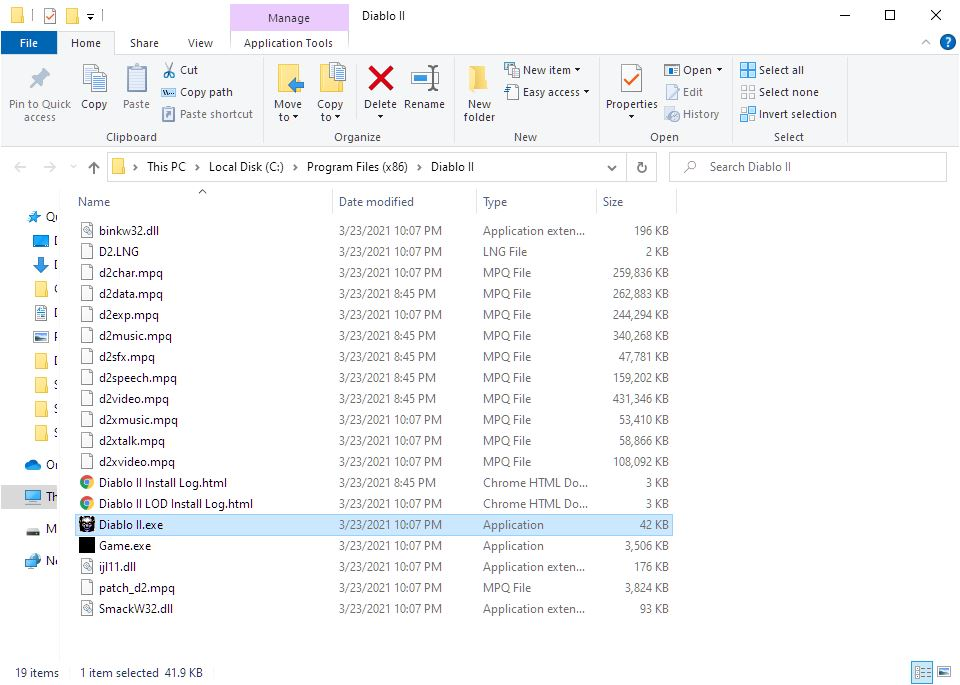

# Locate MPQ files

The MPQ files should be present at your Diablo II installation directory.
The default directory is `C:\Program FIles(x86)\Diablo II`

Once again make sure the you have the `1.14b` version of the game.
