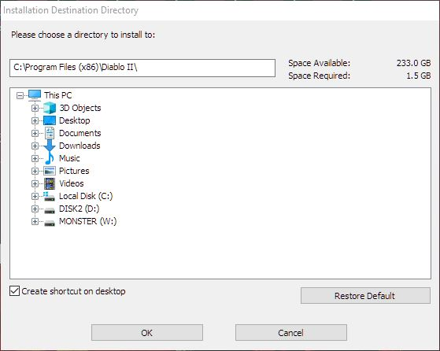

# Purchase the official game

1. Buy [Diablo II (2000)](https://eu.shop.battle.net/en-gb/product/diablo-ii).

2. Write down your CD-Key and start downloading the game.

3. The Blizzard Downloader works only with Windows. Find a Windows PC and download the game.

4. Save the installer setup executable somewhere temporarily in your disk (e.g. `C:/Diablo II`) and wait until the download is complete.

5. When the download is finished the setup will automatically start Diablo II Installer.

6. Begin the installation! Right after accepting the license, it will ask you to insert a name and copy-paste your CD-Key (from step 2).
   In case you forgot to save it, there should be already an e-mail at your inbox about it.

7. Select a directory to install the game. 
   Ideally, use the default location: `C:\Program FIles(x86)\Diablo II`.
   

8. Run the game.
   If you are using `Windows 10` you will get a message prompt saying `Run the program without getting help`.
   Next, click `Don't show this message again` to avoid future noise.
   
9. After the game launches make sure the version is **1.14b**.

### Repeat the exact process for Diablo II: Lord of Destruction

11. Buy [Diablo II: Lord of Destruction (2001)](https://eu.shop.battle.net/en-gb/product/diablo-ii-lord-of-destruction).

12. Repeat the steps **from 2 to 9** for Diablo II: Lord of Destruction.
